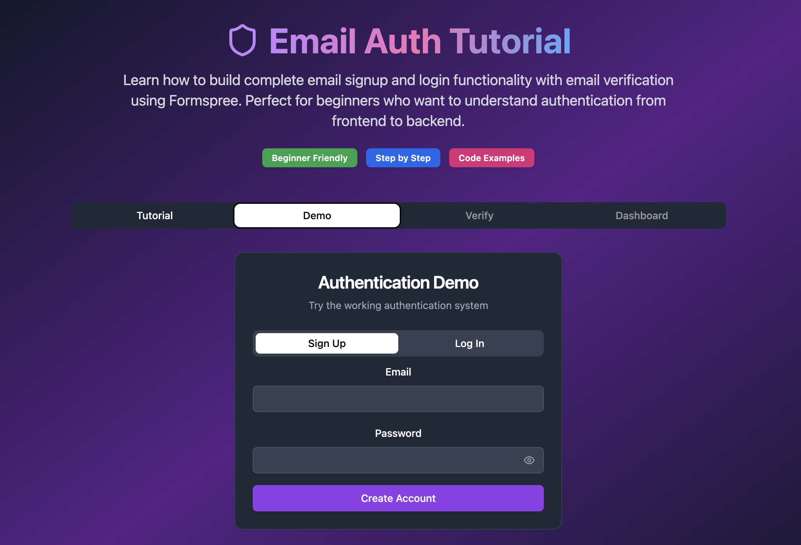

# Complete Email Authentication Tutorial 📧🔐



A comprehensive, interactive tutorial that teaches developers how to build a complete email authentication system from scratch, featuring both educational content and a working demo.

## 🚀 Features

- 🔒 Secure email-based authentication
- 📩 Email verification system
- 🛡️ Protected routes
- 📱 Responsive design
- ⚡ Fast and lightweight
- **Interactive Tutorial**: Step-by-step guide with comprehensive explanations
- **Working Demo**: Fully functional authentication system you can try immediately
- **Beginner Friendly**: Complete setup instructions from Node.js installation to deployment
- **Full Stack**: FastAPI backend with React TypeScript frontend
- **Modern Tech Stack**: Vite, Tailwind CSS, shadcn/ui components
- **Security Best Practices**: Password hashing, JWT tokens, email verification

## 📋 What You'll Learn

- Complete authentication flow (signup, email verification, login, protected routes)
- FastAPI backend development with Python
- React frontend with TypeScript and modern UI components
- Password hashing with bcrypt
- JWT token authentication
- Email verification workflow
- Database integration concepts
- Security best practices

## Live Demo 🌐

Check out the live demo here: [Email Authentication Tutorial](https://email-authentication-tutorial.vercel.app/)

## 🛠 Quick Start

### Prerequisites

- Node.js 18+ (Download from [nodejs.org](https://nodejs.org))
- Python 3.8+ (Download from [python.org](https://python.org))
- A configured email service (e.g., SendGrid, Nodemailer) 📧

### Backend Setup

1. **Install Python dependencies:**
   ```bash
   cd auth-backend
   pip install -r requirements.txt
   ```

2. **Start the FastAPI server:**
   ```bash
   uvicorn app.main:app --reload
   ```

   Backend will be available at `http://localhost:8000`  
   API documentation at `http://localhost:8000/docs`

### Frontend Setup

1. **Navigate to the project directory**:
   ```bash
   cd email-authentication-tutorial
   ```

2. **Install Node.js dependencies:**
   ```bash
   npm install
   ```

3. **Start the React development server:**
   ```bash
   npm run dev
   ```

4. **Open your browser and visit**:
   ```
   http://localhost:5173
   ```

## 🎯 How to Use This Tutorial

1. **Tutorial Tab**: Learn the concepts and see code examples
2. **Demo Tab**: Try the working authentication system
3. **Verify Tab**: Test email verification (activated after signup)
4. **Dashboard Tab**: Access protected content (activated after login)

## 🏗 Project Structure

```
email-authentication-tutorial/
├── auth-backend/              # FastAPI backend
│   ├── app/
│   │   └── main.py           # Main application with all endpoints
│   └── requirements.txt      # Python dependencies
├── src/                      # React frontend
│   ├── App.tsx              # Main application with tutorial and demo
│   ├── components/          # shadcn/ui components
│   └── ...
├── .env                     # Environment variables
└── README.md               # This file
```

## 🔧 API Endpoints

- `POST /api/signup` - Create new user account
- `POST /api/verify-email` - Verify email with 5-digit code
- `POST /api/login` - Authenticate user and get JWT token
- `GET /api/dashboard` - Protected route requiring authentication
- `GET /api/users` - List all users (for testing)
- `GET /healthz` - Health check endpoint

## 🔐 Authentication Flow

1. **Sign Up**: User creates account with email/password
2. **Email Verification**: System generates 5-digit code for verification
3. **Verify Email**: User enters code to activate account
4. **Log In**: User signs in with verified credentials
5. **Access Dashboard**: User can access protected routes with JWT token

## 💾 Database

This tutorial uses an in-memory database for simplicity and immediate testing. User data persists during the server session but resets when restarted. This demonstrates:

- User registration and storage
- Password hashing with bcrypt
- Email verification workflow
- JWT token authentication
- Protected route access

## 🚀 Next Steps

After completing this tutorial, you can:

- Implement password reset functionality
- Add social login options (Google, GitHub)
- Build user profile management
- Add two-factor authentication
- Implement role-based access control
- Deploy to production with a real database

## 🤝 Contributing

We welcome contributions! Please follow these steps:

1. Fork the repository 🍴
2. Create a new branch:
   ```bash
   git checkout -b feature/awesome-feature
   ```
3. Commit your changes:
   ```bash
   git commit -m 'Add awesome feature'
   ```
4. Push to the branch:
   ```bash
   git push origin feature/awesome-feature
   ```
5. Open a Pull Request 📬

## 📄 License

MIT License - feel free to use this tutorial for learning and teaching purposes.

## 📬 Contact

Have questions? Reach out to **raimonvibe** or open an issue! 😊

Happy coding! 🎉
